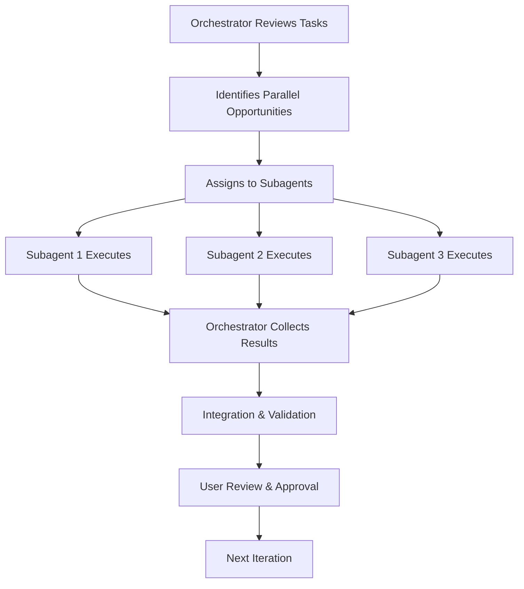

# 🎭 Orchestrator Strategy - Parallel Subagent Execution Plan

## Overview

This document outlines how the project-orchestrator agent will coordinate multiple specialized subagents to build the Nail App efficiently through parallel execution while maintaining code quality, security, and coherence.

## 🎯 Orchestrator Mission

The orchestrator acts as the project manager, delegating specialized tasks to appropriate subagents, coordinating their outputs, and ensuring all work aligns with the master implementation plan.

## 📊 Parallel Execution Strategy

### Execution Phases and Parallelization

```yaml
Phase 1: Foundation (Days 1-5)
  Parallel Tracks:
    Track A: Project Setup
      - project-orchestrator: Initialize Next.js, configure build
      - supabase-architect: Database schema design
      
    Track B: Core Infrastructure  
      - security-audit-specialist: Security framework setup
      - refactoring-architect: Component architecture design
      
    Track C: Design System
      - general-purpose: Create UI components
      - general-purpose: Implement animations

Phase 2: Features (Days 6-10)
  Parallel Tracks:
    Track A: Camera & Upload
      - general-purpose: Camera interface
      - security-audit-specialist: Image validation
      
    Track B: AI Integration
      - general-purpose: Gemini API setup
      - security-audit-specialist: API key management
      
    Track C: Data Layer
      - supabase-architect: Storage setup
      - general-purpose: State management

Phase 3: Enhancement (Days 11-15)
  Parallel Tracks:
    Track A: User Features
      - general-purpose: Favorites system
      - general-purpose: Sharing features
      
    Track B: Testing
      - qa-test-engineer: Test suite setup
      - qa-test-engineer: E2E tests
      
    Track C: Optimization
      - refactoring-architect: Performance tuning
      - security-audit-specialist: Final audit

Phase 4: Polish (Days 16-20)
  Sequential Execution:
    - qa-test-engineer: Final testing
    - security-audit-specialist: Security review
    - project-orchestrator: Deployment
```

## 🤖 Subagent Roles & Responsibilities

### 1. Project-Orchestrator (Leader)

```markdown
## Role: Project Manager & Coordinator

### Responsibilities:
- Initialize project structure
- Coordinate parallel execution
- Merge subagent outputs
- Resolve conflicts
- Maintain implementation timeline
- Ensure coherent architecture

### Execution Pattern:
1. Break down daily tasks into parallel tracks
2. Assign specialized tasks to subagents
3. Provide context and requirements to each
4. Collect and integrate outputs
5. Validate combined work
6. Report progress to user

### Key Decisions:
- Task prioritization
- Dependency management
- Conflict resolution
- Architecture decisions
```

### 2. Supabase-Architect

```markdown
## Role: Database & Backend Specialist

### Responsibilities:
- Design database schema
- Implement RLS policies
- Configure storage buckets
- Set up authentication
- Optimize queries
- Handle real-time subscriptions

### Parallel Tasks:
- Can work independently on:
  * Database schema creation
  * Storage configuration
  * Auth setup
  * API endpoints

### Dependencies:
- Needs from orchestrator:
  * Data model requirements
  * Security requirements
  * User flow specifications
```

### 3. Security-Audit-Specialist

```markdown
## Role: Security & Compliance Expert

### Responsibilities:
- Audit API implementations
- Review authentication flows
- Validate input sanitization
- Check for vulnerabilities
- Ensure GDPR compliance
- Review secret management

### Parallel Tasks:
- Can work independently on:
  * Security framework setup
  * Vulnerability scanning
  * Compliance documentation
  * Rate limiting implementation

### Critical Gates:
- Must review before:
  * API deployment
  * Auth implementation
  * Payment processing
  * Data storage
```

### 4. Refactoring-Architect

```markdown
## Role: Code Quality & Architecture Expert

### Responsibilities:
- Design component architecture
- Optimize performance
- Ensure code reusability
- Implement design patterns
- Reduce technical debt
- Maintain clean code

### Parallel Tasks:
- Can work independently on:
  * Component structure design
  * Performance optimization
  * Code splitting strategy
  * Bundle optimization

### Integration Points:
- Coordinates with:
  * Orchestrator for architecture
  * QA for testing patterns
  * Security for best practices
```

### 5. QA-Test-Engineer

```markdown
## Role: Testing & Quality Assurance

### Responsibilities:
- Design test strategy
- Write unit tests
- Implement E2E tests
- Mobile device testing
- Performance testing
- Bug tracking

### Parallel Tasks:
- Can work independently on:
  * Test framework setup
  * Test data preparation
  * CI/CD pipeline
  * Automated testing

### Dependencies:
- Needs from development:
  * Completed features
  * API documentation
  * Component specs
```

### 6. General-Purpose Agents (Multiple)

```markdown
## Role: Feature Development

### Responsibilities:
- Implement UI components
- Build features
- Integrate APIs
- Create animations
- Handle data flow

### Parallel Distribution:
- Agent 1: Camera and image features
- Agent 2: Color selection and UI
- Agent 3: Results and sharing
- Agent 4: Profile and settings

### Coordination:
- Report to orchestrator
- Follow design system
- Use shared utilities
```

## 🔄 Coordination Workflow

### Daily Execution Pattern



### Communication Protocol

```typescript
interface SubagentTask {
  id: string;
  agent: AgentType;
  priority: 'critical' | 'high' | 'medium' | 'low';
  dependencies: string[];
  
  input: {
    requirements: string[];
    context: any;
    constraints: string[];
    deadline: Date;
  };
  
  output: {
    deliverables: string[];
    documentation: string;
    tests: string[];
    reviewNeeded: boolean;
  };
  
  status: 'pending' | 'in-progress' | 'review' | 'complete' | 'blocked';
}

class OrchestratorCoordinator {
  private tasks: Map<string, SubagentTask>;
  private agents: Map<AgentType, AgentStatus>;
  
  async distributeTasks(dailyTasks: Task[]): Promise<void> {
    const parallelGroups = this.identifyParallelWork(dailyTasks);
    
    for (const group of parallelGroups) {
      await Promise.all(
        group.map(task => this.assignToAgent(task))
      );
    }
  }
  
  async collectResults(): Promise<IntegratedResult> {
    const results = await Promise.all(
      Array.from(this.tasks.values())
        .filter(t => t.status === 'complete')
        .map(t => this.getAgentOutput(t.id))
    );
    
    return this.integrateResults(results);
  }
  
  private identifyParallelWork(tasks: Task[]): Task[][] {
    // Group tasks that can run in parallel
    const groups: Task[][] = [];
    const independent = tasks.filter(t => !t.dependencies.length);
    const dependent = tasks.filter(t => t.dependencies.length > 0);
    
    groups.push(independent);
    
    // Topologically sort dependent tasks
    while (dependent.length > 0) {
      const ready = dependent.filter(t => 
        t.dependencies.every(d => 
          groups.flat().some(g => g.id === d)
        )
      );
      groups.push(ready);
      dependent = dependent.filter(t => !ready.includes(t));
    }
    
    return groups;
  }
}
```

## 📋 Task Distribution Matrix

### Subagent Specialization Map

```yaml
Component Development:
  Camera Interface: general-purpose-1
  Color Picker: general-purpose-2
  Loading Animation: general-purpose-3
  Results Display: general-purpose-4

Backend Development:
  Database Schema: supabase-architect
  Storage Setup: supabase-architect
  Auth System: supabase-architect + security-audit-specialist
  API Routes: general-purpose + security-audit-specialist

Quality Assurance:
  Unit Tests: qa-test-engineer
  Integration Tests: qa-test-engineer
  E2E Tests: qa-test-engineer
  Performance Tests: qa-test-engineer + refactoring-architect

Security:
  API Security: security-audit-specialist
  Auth Security: security-audit-specialist
  Data Validation: security-audit-specialist
  GDPR Compliance: security-audit-specialist

Optimization:
  Code Structure: refactoring-architect
  Performance: refactoring-architect
  Bundle Size: refactoring-architect
  Clean Code: refactoring-architect
```

## 🚦 Synchronization Points

### Critical Gates Requiring Synchronization

```markdown
1. **After Project Setup** (Day 1)
   - All agents sync on project structure
   - Shared understanding of architecture

2. **Before API Integration** (Day 5)
   - Security review required
   - Database schema finalized
   - Auth system approved

3. **After Core Features** (Day 10)
   - Integration testing
   - Performance review
   - Security audit

4. **Before Deployment** (Day 19)
   - Final security audit
   - All tests passing
   - Performance validated

5. **Production Release** (Day 20)
   - All agents sign-off
   - Documentation complete
   - Monitoring active
```

## 🔧 Conflict Resolution

### Merge Conflict Strategy

```typescript
class ConflictResolver {
  async resolveConflicts(
    outputs: AgentOutput[]
  ): Promise<ResolvedOutput> {
    // 1. Identify conflicts
    const conflicts = this.detectConflicts(outputs);
    
    // 2. Apply resolution strategy
    for (const conflict of conflicts) {
      switch (conflict.type) {
        case 'file-collision':
          // Later timestamp wins, notify user
          await this.resolveFileCollision(conflict);
          break;
          
        case 'architecture-mismatch':
          // Escalate to user for decision
          await this.escalateToUser(conflict);
          break;
          
        case 'dependency-conflict':
          // Use higher version, test compatibility
          await this.resolveDependency(conflict);
          break;
          
        case 'style-inconsistency':
          // Apply design system rules
          await this.applyStyleGuide(conflict);
          break;
      }
    }
    
    return this.mergeOutputs(outputs);
  }
}
```

## 📊 Progress Tracking

### Multi-Agent Progress Dashboard

```typescript
interface ProgressDashboard {
  overall: {
    phase: string;
    dayNumber: number;
    completion: number; // percentage
    blockers: string[];
  };
  
  agents: {
    [agentName: string]: {
      currentTask: string;
      status: 'idle' | 'working' | 'blocked' | 'complete';
      tasksCompleted: number;
      tasksRemaining: number;
      estimatedCompletion: Date;
    };
  };
  
  metrics: {
    parallelEfficiency: number; // 0-100%
    codeQuality: number; // 0-100
    testCoverage: number; // 0-100%
    securityScore: number; // 0-100
  };
}
```

## 🎯 Success Metrics

### Orchestration Effectiveness

```yaml
Efficiency Metrics:
  - Parallel execution rate: >60%
  - Task completion rate: >95%
  - Conflict rate: <5%
  - Rework rate: <10%
  
Quality Metrics:
  - Code consistency: >90%
  - Test coverage: >80%
  - Security score: >95%
  - Documentation: 100%
  
Time Metrics:
  - On-schedule delivery: 100%
  - Blocker resolution: <4 hours
  - Integration time: <2 hours/day
  - Review turnaround: <1 hour
```

## 🚀 Orchestrator Commands

### Execution Commands

```bash
# Initialize orchestration
orchestrator init --project nail-app --agents 6

# Start daily execution
orchestrator execute --day 1 --parallel

# Check progress
orchestrator status --detailed

# Resolve conflicts
orchestrator resolve --interactive

# Integrate outputs
orchestrator integrate --validate

# Generate report
orchestrator report --day 1

# Emergency stop
orchestrator halt --save-state
```

## 📝 Daily Orchestration Checklist

```markdown
## Morning Standup
□ Review implementation plan for the day
□ Identify parallel execution opportunities
□ Check agent availability
□ Assign tasks to agents
□ Set synchronization points
□ Define success criteria

## Execution Monitoring
□ Track agent progress
□ Monitor for blockers
□ Resolve conflicts quickly
□ Maintain communication
□ Ensure quality standards

## Evening Integration
□ Collect all agent outputs
□ Run integration tests
□ Resolve any conflicts
□ Update documentation
□ Prepare status report
□ Plan next day's tasks

## Quality Gates
□ Code review completed
□ Tests passing
□ Security validated
□ Performance checked
□ Documentation updated
□ User approval obtained
```

## 🔐 Security Coordination

### Security Integration Points

```yaml
Mandatory Security Reviews:
  Day 3: After database schema
  Day 5: Before API integration  
  Day 7: After auth implementation
  Day 10: After core features
  Day 15: Before optimization
  Day 19: Final security audit
  
Security Agent Veto Power:
  - Can block deployment
  - Can require immediate fixes
  - Can escalate to user
  - Must approve all external integrations
```

## 💡 Optimization Strategies

### Maximizing Parallel Efficiency

1. **Minimize Dependencies**: Design components to be independent
2. **Clear Interfaces**: Define clear contracts between components
3. **Atomic Tasks**: Break work into smallest independent units
4. **Async Communication**: Use async patterns for agent communication
5. **Cache Sharing**: Share build caches and dependencies
6. **Continuous Integration**: Integrate work frequently to avoid conflicts

---

This orchestrator strategy ensures efficient parallel development while maintaining code quality, security, and project coherence. The orchestrator acts as the central coordinator, enabling multiple specialized agents to work simultaneously while preventing conflicts and ensuring all work aligns with the project vision.